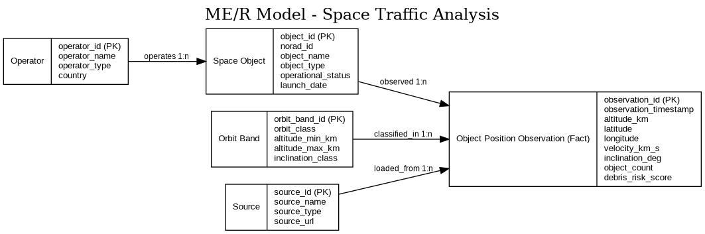

Data Warehousing | Summer Semester 2026 | Prof. Schildgen | OTH Regensburg

-----

**Name:** Erik Schreider

# Challenge 3: Data Modelling and Importing the Data

**Tasks:** 
1. Fill out this workbook. You can use a markdown software (e.g., [Zettlr](https://www.zettlr.com/)) for that, or an online editor (e.g., [md2pdf](https://md2pdf.netlify.app/) or Notion). 
2. You can use a [Markdown Cheat Sheet](https://padomi.id.lv/PRG/par__/Markdown-Cheat-Sheet.pdf) to understand how to write *italic*, **bold**, `code`, etc.
3. Fill out this workbook with care. It will be graded with points. Write high-class content, but compact. Before you submit, read everything again and improve. 
4. When you are finished, export your workbook as a PDF and upload it to ELO before the deadline. Open your PDF in a PDF viewer to check whether everything was exported correctly and no code blocks are cut off.
5. In this workbook, you need to write SQL commands. Put them in code blocks and split long queries into multiple lines.

```sql
-- This is just an example. You do not need to write anything here.
```


## Title


**Space Traffic Analysis - Kollisionsrisiken und Nachhaltigkeit im Erdorbit**

Das Projekt analysiert aktive Satelliten, inaktive Weltraumobjekte, Raketenstufen und Weltraumschrott im Erdorbit. Ziel ist der Aufbau eines Data Warehouse, das Orbitdaten von CelesTrak mit Satelliten-Metadaten aus der UCS Satellite Database kombiniert. Das Warehouse wird verwendet, um Satellitendichte, Verteilung von Weltraumschrott, Beiträge nach Betreiber und Land sowie mögliche Risikozonen im Zusammenhang mit dem Kessler-Syndrom zu analysieren.


## Staging Area: Tables
*Write down your `CREATE TABLE` commands to create your tables in which you import your data from the data sources.  (Ex. Sheet 3, Exercise 1.3)*

Die Staging Area speichert die importierten Daten möglichst nah am ursprünglichen Quellformat. Die eigentliche analytische Struktur wird später im Star Schema aufgebaut.

```sql
CREATE TABLE stg_celestrak_gp_objects (
    norad_id              DECIMAL(10,0),
    object_name           VARCHAR(200),
    object_id             VARCHAR(50),
    epoch_timestamp       TIMESTAMP,
    mean_motion           DECIMAL(18,10),
    eccentricity          DECIMAL(18,10),
    inclination_deg       DECIMAL(10,6),
    raan_deg              DECIMAL(10,6),
    arg_perigee_deg       DECIMAL(10,6),
    mean_anomaly_deg      DECIMAL(10,6),
    bstar                 DECIMAL(18,10),
    ephemeris_type        DECIMAL(3,0),
    element_set_no        DECIMAL(10,0),
    revolution_no         DECIMAL(10,0),
    source_file           VARCHAR(200),
    load_timestamp        TIMESTAMP
);
```

```sql
CREATE TABLE stg_ucs_satellites (
    norad_id              DECIMAL(10,0),
    satellite_name        VARCHAR(250),
    country               VARCHAR(100),
    operator_name         VARCHAR(250),
    operator_type         VARCHAR(100),
    users                 VARCHAR(200),
    purpose               VARCHAR(250),
    detailed_purpose      VARCHAR(500),
    orbit_class           VARCHAR(20),
    launch_date           DATE,
    expected_lifetime     DECIMAL(10,2),
    launch_mass_kg        DECIMAL(12,2),
    source_file           VARCHAR(200),
    load_timestamp        TIMESTAMP
);
```

```sql
CREATE TABLE stg_launch_events (
    launch_id             VARCHAR(100),
    launch_name           VARCHAR(500),
    launch_timestamp      TIMESTAMP,
    launch_status         VARCHAR(100),
    provider_name         VARCHAR(250),
    rocket_name           VARCHAR(250),
    launch_site_name      VARCHAR(500),
    launch_country        VARCHAR(100),
    mission_type          VARCHAR(250),
    payload_count         DECIMAL(10,0),
    source_file           VARCHAR(200),
    load_timestamp        TIMESTAMP
);
```


## Forms of Heterogeneity
*Which forms of heterogeneity exist between two of your data sources? Write at least one example. (Ex. Sheet 3, Exercise 1.4)*

* **Formatheterogenität:** CelesTrak stellt Orbitdaten als TLE- bzw. GP-Daten bereit. Diese enthalten kompakte Bahnparameter. Die UCS Satellite Database stellt dagegen eine CSV- bzw. Excel-Tabelle mit beschreibenden Satelliten-Metadaten bereit. Deshalb müssen die CelesTrak-Daten zuerst geparst und transformiert werden, bevor sie mit UCS verbunden werden können.
* **Strukturelle Heterogenität:** CelesTrak beschreibt den aktuellen orbitalen Zustand eines Objekts, während UCS Geschäfts- und Missionsinformationen wie Land, Betreiber und Zweck beschreibt. CelesTrak wird daher hauptsächlich als Quelle für Fakten genutzt, UCS hauptsächlich als Quelle für Dimensionsdaten.
* **Semantische Heterogenität:** Dasselbe reale Objekt kann unterschiedlich bezeichnet werden. CelesTrak kann Objektnamen wie `STARLINK-1007` verwenden, während UCS teilweise ausführlichere Satellitennamen nutzt. Der stabile Integrationsschlüssel ist deshalb die NORAD ID.
* **Abdeckungsheterogenität:** CelesTrak enthält aktive Satelliten, inaktive Objekte, Raketenstufen und Trümmerteile. UCS enthält hauptsächlich Satelliten-Metadaten und beschreibt Trümmerteile nicht im gleichen Detail. Deshalb können Weltraumschrott-Objekte im Warehouse unbekannte Werte für Betreiber oder Zweck haben.

## Star / Snowflake Schema
*Your task was to decide whether to use a star schema or a snowflake schema (or a mix of both) within your data warehouse. Provide the `CREATE TABLE` commands of your final schema here. (Ex. Sheet 3, Exercise 1.6)*

Ich verwende ein überwiegend sternförmiges Schema mit einer kleinen Snowflake-Erweiterung für die Betreiber-Dimension. Die zentrale Faktentabelle speichert jeweils eine beobachtete Objektposition zu einem bestimmten Zeitpunkt. Eine separate Zeitdimension wird nicht modelliert; Zeitstempel werden direkt in den Faktentabellen gespeichert.


**Fact table(s):**

```sql
CREATE TABLE fact_object_position_observation (
    observation_id         DECIMAL(18,0),
    object_id              DECIMAL(18,0),
    orbit_band_id          DECIMAL(18,0),
    source_id              DECIMAL(18,0),
    observation_timestamp  TIMESTAMP,
    altitude_km            DECIMAL(10,3),
    latitude               DECIMAL(9,6),
    longitude              DECIMAL(9,6),
    velocity_km_s          DECIMAL(10,5),
    inclination_deg        DECIMAL(8,4),
    object_count           DECIMAL(1,0),
    debris_risk_score      DECIMAL(8,4)
);
```

```sql
CREATE TABLE fact_launch_event (
    launch_fact_id         DECIMAL(18,0),
    source_id              DECIMAL(18,0),
    launch_timestamp       TIMESTAMP,
    provider_name          VARCHAR(250),
    rocket_name            VARCHAR(250),
    launch_country         VARCHAR(100),
    launch_status          VARCHAR(100),
    payload_count          DECIMAL(10,0),
    success_count          DECIMAL(1,0)
);
```

Kennzahlen:

| Kennzahl | Datentyp | Wertebereich | Aggregationstyp |
|---|---:|---:|---|
| altitude_km | DECIMAL(10,3) | ungefähr 100 - 50.000 km | VPU |
| latitude | DECIMAL(9,6) | -90 bis 90 | VPU |
| longitude | DECIMAL(9,6) | -180 bis 180 | VPU |
| velocity_km_s | DECIMAL(10,5) | 0 - 15 km/s | VPU |
| inclination_deg | DECIMAL(8,4) | 0 - 180 Grad | VPU |
| object_count | DECIMAL(1,0) | immer 1 pro Zeile | FLOW |
| debris_risk_score | DECIMAL(8,4) | 0 - 100 | VPU |
| payload_count | DECIMAL(10,0) | 0 - mehrere Hundert | FLOW |
| success_count | DECIMAL(1,0) | 0 oder 1 | FLOW |

Die meisten Orbitwerte sind VPU-Werte, weil eine Summe dieser Werte fachlich nicht sinnvoll ist. Sie können mit AVG, MIN und MAX analysiert werden. `object_count`, `payload_count` und `success_count` sind FLOW-Kennzahlen, weil sie über Zeiträume oder nach Dimensionsattributen summiert werden können.

Der `debris_risk_score` ist kein physikalisch exakter Kollisionswert. Er ist eine einfache analytische Kennzahl für dieses Semesterprojekt, die aus Faktoren wie Objektdichte, Anteil von Trümmerobjekten und Orbitband abgeleitet werden kann. Für echte Kollisionswahrscheinlichkeiten wären genauere Bahndaten, Unsicherheitsmodelle und Conjunction-Analysen notwendig.

**Dimension table(s):**

```sql
CREATE TABLE dim_operator (
    operator_id            DECIMAL(18,0),
    operator_name          VARCHAR(250),
    operator_type          VARCHAR(100),
    country                VARCHAR(100)
);
```

```sql
CREATE TABLE dim_space_object (
    object_id              DECIMAL(18,0),
    norad_id               DECIMAL(10,0),
    object_name            VARCHAR(250),
    object_type            VARCHAR(100),
    operational_status     VARCHAR(100),
    purpose                VARCHAR(250),
    launch_date            DATE,
    operator_id            DECIMAL(18,0)
);
```

```sql
CREATE TABLE dim_orbit_band (
    orbit_band_id          DECIMAL(18,0),
    orbit_class            VARCHAR(20),
    altitude_min_km        DECIMAL(10,3),
    altitude_max_km        DECIMAL(10,3),
    inclination_class      VARCHAR(100)
);
```

```sql
CREATE TABLE dim_source (
    source_id              DECIMAL(18,0),
    source_name            VARCHAR(150),
    source_type            VARCHAR(100),
    source_url             VARCHAR(500)
);
```

Beispielzeilen:

```sql
INSERT INTO dim_operator VALUES
(1, 'SpaceX', 'Commercial', 'USA');

INSERT INTO dim_operator VALUES
(2, 'Unknown', 'Unknown', 'Unknown');
```

```sql
INSERT INTO dim_space_object VALUES
(
    1,
    44713,
    'STARLINK-1007',
    'Active Satellite',
    'Active',
    'Communications',
    DATE '2019-11-11',
    1
);

INSERT INTO dim_space_object VALUES
(
    2,
    33757,
    'COSMOS 2251 DEB',
    'Debris',
    'Inactive',
    'Debris Fragment',
    DATE '2009-02-10',
    2
);
```

```sql
INSERT INTO dim_orbit_band VALUES
(1, 'LEO', 160.000, 2000.000, 'Inclined');

INSERT INTO dim_orbit_band VALUES
(2, 'GEO', 35700.000, 35900.000, 'Equatorial');
```

```sql
INSERT INTO dim_source VALUES
(
    1,
    'CelesTrak',
    'TLE / GP Data',
    'https://celestrak.org/NORAD/elements/'
);

INSERT INTO dim_source VALUES
(
    2,
    'UCS Satellite Database',
    'CSV / Excel',
    'https://www.ucsusa.org/resources/satellite-database'
);

INSERT INTO dim_source VALUES
(
    3,
    'Launch Data API',
    'CSV / API',
    'https://thespacedevs.com/llapi'
);
```

```sql
INSERT INTO fact_object_position_observation VALUES
(
    1,
    1,
    1,
    1,
    TIMESTAMP '2026-05-24 12:00:00',
    550.250,
    48.137154,
    11.576124,
    7.62000,
    53.0000,
    1,
    12.5000
);

INSERT INTO fact_object_position_observation VALUES
(
    2,
    2,
    1,
    1,
    TIMESTAMP '2026-05-24 12:00:00',
    780.600,
    51.050407,
    13.737262,
    7.45000,
    74.0200,
    1,
    64.3000
);
```

```sql
INSERT INTO fact_launch_event VALUES
(
    1,
    3,
    TIMESTAMP '2026-05-01 10:35:00',
    'SpaceX',
    'Falcon 9',
    'USA',
    'Success',
    23,
    1
);

INSERT INTO fact_launch_event VALUES
(
    2,
    3,
    TIMESTAMP '2026-05-02 17:10:00',
    'Unknown Provider',
    'Unknown Rocket',
    'Unknown',
    'Unknown',
    0,
    0
);
```

Snowflake-Alternative:

In einem reinen Snowflake Schema würden die Objekt- und Betreiber-Dimensionen weiter normalisiert. Zum Beispiel würde `dim_space_object` auf `dim_object_type`, `dim_status` und `dim_operator` verweisen. `dim_operator` würde dann auf `dim_country` und `dim_operator_type` verweisen. Das reduziert Redundanz, erhöht aber die Anzahl der Joins.

Entscheidung:

Ich verwende ein überwiegend sternförmiges Schema mit einer kleinen Snowflake-Erweiterung für Betreiber. Das Star Schema ist einfacher abzufragen und zu erklären, während die separate Betreiber-Dimension unnötige Wiederholungen von Betreiber- und Länderinformationen vermeidet. Das ist ein sinnvoller Kompromiss, weil Betreiber und Länder wichtige Analysedimensionen in diesem Projekt sind.


## IMPORT
*Write down IMPORT commands to import data from your data sources into your staging area tables. (Ex. Sheet 3, Exercise 2.1)*

Die rohen TLE- und API-Daten werden zuerst durch ein ETL-Skript heruntergeladen. Das Skript wandelt die Daten in CSV-Dateien um, die anschließend in Exasol importiert werden können. Dadurch bleibt der Datenbankimport einfach und reproduzierbar.

Die folgenden `IMPORT`-Befehle funktionieren, wenn sie über einen Exasol-Client mit Zugriff auf lokale Dateien ausgeführt werden, zum Beispiel EXAplus oder JDBC. In webbasierten Exasol-Worksheets ist `FROM LOCAL CSV FILE` je nach Umgebung nicht verfügbar; dort müsste die Datei über einen Serverpfad, HTTP/HTTPS, SFTP oder einen anderen unterstützten Importweg bereitgestellt werden.

```sql
IMPORT INTO stg_celestrak_gp_objects
FROM LOCAL CSV FILE 'data/celestrak_gp_objects.csv'
COLUMN SEPARATOR = ','
COLUMN DELIMITER = '"'
SKIP = 1;
```

```sql
IMPORT INTO stg_ucs_satellites
FROM LOCAL CSV FILE 'data/ucs_satellites.csv'
COLUMN SEPARATOR = ','
COLUMN DELIMITER = '"'
SKIP = 1;
```

```sql
IMPORT INTO stg_launch_events
FROM LOCAL CSV FILE 'data/launch_events.csv'
COLUMN SEPARATOR = ','
COLUMN DELIMITER = '"'
SKIP = 1;
```

Der ETL-Prozess soll einmal pro Tag automatisch laufen. Er lädt aktuelle CelesTrak-Daten herunter, transformiert TLE- bzw. GP-Datensätze in strukturierte Zeilen, reichert die Objekte mit UCS-Metadaten an und lädt den aktuellen Snapshot in das Warehouse.


## Numbers
* Numbers of rows in your biggest table: ungefähr 5.000.000 Zeilen nach einem Semester mit täglichen Snapshots
* Size (KB, MB, or GB) of your biggest table: ungefähr 800 MB
* Name of that biggest table: `fact_object_position_observation`
* Total size (KB, MB, or GB) of your schema: ungefähr 1 GB

Das sind Schätzwerte. Die größte Tabelle wird die Positions-Faktentabelle sein, weil sie wiederholte Beobachtungen über die Zeit speichert. Wenn ungefähr 35.000 Objekte einmal pro Tag für ungefähr 140 Tage gespeichert werden, enthält die Tabelle etwa 4,9 Millionen Zeilen. Die tatsächliche Größe hängt von der Anzahl der importierten Objektgruppen und der Anzahl der berechneten Attribute ab.




Hierarchische Dimensionen:

* **Betreiber-Hierarchie:** Betreiber -> Betreibertyp -> Land
* **Orbit-Hierarchie:** Orbitband -> Orbitklasse, zum Beispiel LEO, MEO, GEO
* **Objekt-Hierarchie:** Weltraumobjekt -> Objekttyp -> Betriebsstatus

Die Faktenbeziehung ist `Object Position Observation`. Sie verbindet ein beobachtetes Weltraumobjekt mit einem Orbitband und einer Quelle zu einem bestimmten Zeitstempel.
